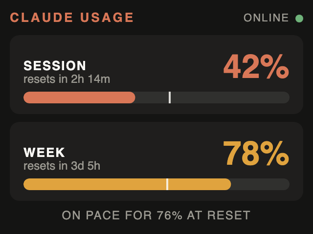

# claude-monitor

A desk display for Claude subscription usage on an ESP32-S3-BOX-3 or a LilyGO
T4-S3: five-hour
and seven-day utilisation, reset countdowns, and whether the current pace runs
into the limit before the window resets.

<p align="center">
  
</p>

It is standalone. There is no companion program on a computer: the box joins
WiFi and asks the Anthropic API itself, once a minute. Tap the screen to poll
immediately.

The white tick on each bar marks where an even burn rate would be by now:
usage past it means the window runs out before it resets.

Bare-metal Rust (`no_std`, esp-hal), no ESP-IDF. UI in [Slint](https://slint.dev).

This is an unofficial project, not affiliated with or endorsed by Anthropic. It
reads usage from response headers that are not a documented interface, so it
may stop working without notice.

## Setup

You need the `esp` Rust toolchain ([espup](https://github.com/esp-rs/espup))
and `espflash`.

```sh
. ~/export-esp.sh
cargo run --release        # builds, flashes, and opens the serial monitor
```

That builds for the ESP32-S3-BOX-3. For the LilyGO T4-S3, with its 2.41"
600×450 AMOLED, pick the other board feature:

```sh
cargo run --release --no-default-features --features t4-s3
```

The T4-S3 shows the same 320×240 layout, drawn 1.875 times larger: the panel
has the same 4:3 shape. Its support (`src/t4_s3.rs`) is written from LilyGO's
reference driver and has not yet been tried on the hardware.

A freshly flashed box starts in setup mode and is configured from a phone:

1. The screen shows a QR code. Scan it to join the box's own WiFi network
   (the name and password are on screen too, and change on every boot).
2. The phone's sign-in sheet opens with the setup form. If it does not, the
   screen has moved on to a second QR code for `http://192.168.4.1/`.
3. Pick your WiFi network, enter its password, and paste a token from
   `claude setup-token`. The token is on your computer, not your phone:
   Universal Clipboard carries it across on Apple devices, or join the setup
   network from the computer instead and fill the form in there.
4. The box saves the settings to flash, takes its network down, restarts and
   joins yours.

Your WiFi must be 2.4 GHz and WPA2; the bare-metal driver does not do
WPA3-only networks.

The box remembers up to eight networks and joins whichever is in range,
strongest first, so places you visit regularly need setup once. To add one,
hold a finger on the screen for three seconds and pick **Add a WiFi network**:
setup starts again with the strongest network in range already filled in, the
stored networks listed (each with a *forget* box), and the token kept unless
you paste a new one to switch accounts. **Start over** forgets everything.
Either is also the way out when the box cannot join any of its networks; it
never drops into setup mode by itself, so a rebooting router cannot strand it
there. With none of its networks in range it shows *NO KNOWN WIFI* and keeps
rescanning.

For development, `secrets.env` (see `secrets.env.example`) bakes settings into
the firmware so that a wiped box comes up configured. Settings saved through
the form take precedence over it.

### Where the secrets live

The setup form travels over plain HTTP, but inside a WPA2 network whose
password is random per boot and shown only on the device's own screen, so
reading it takes being in the room. Afterwards the WiFi password and the token
sit unencrypted in flash, where anyone holding the board can read them out.
Treat the box like a logged-in laptop, and revoke the token if it goes missing.

### Why `claude setup-token`

Claude Code's own credential in `~/.claude/.credentials.json` rotates regularly,
so a device holding a copy of it is soon locked out. `claude setup-token` issues
a long-lived (one year) subscription token instead, which the device can keep.

## How it works

There is no usage endpoint for subscriptions. The numbers ride on the
`anthropic-ratelimit-unified-*` response headers of any `/v1/messages` call, so
the device sends the cheapest request it can (Haiku, `max_tokens: 1`), reads the
response head, and drops the connection. Each poll therefore costs a few tokens
of subscription usage.

The device has no clock. Reset times arrive as absolute epoch stamps; the
server's own `Date` header is the reference that turns them into countdowns,
which then run on the monotonic timer between polls.

| Core | Job |
|---|---|
| 0 | Slint event loop from the board support (display, touch). It busy-polls and never yields. |
| 1 | embassy executor: esp-radio WiFi, embassy-net, mbedtls TLS, the poll loop. |

Slint is built single-threaded, so the cores share only a small `Copy` snapshot
(`src/state.rs`) that a Slint timer polls twice a second.

Flash writes need care with this split. Writing stalls the other core wherever
it is; stalled inside a critical section it keeps the global lock and the
writer deadlocks. And the embassy timer interrupt is serviced by core 0, so
once that core stops, no timer on core 1 fires again. Every write here is
followed by a restart, which makes the answer simple: core 0 halts itself from
its timer callback, holding nothing, and core 1 then writes and resets without
waiting on anything (`state::halt_ui_core`).

The WiFi driver can wedge: after some disconnect it answers every reconnect
with `NoAccessPointFound` although the network is there, and esp-radio 0.18
has no call to re-initialise it. When connect attempts have failed without a
break for two minutes the box resets itself, which rebuilds the driver from
scratch. The last reading rides across in RTC memory, so the display keeps its
numbers and countdowns (marked stale) instead of going blank.

TLS is mbedtls (via `mbedtls-rs`) with chain and hostname verification against
the roots in `certs/`; see `certs/README.md` for the one thing it cannot check.

## Layout

- `ui/main.slint` — the 320×240 UI. Preview with `slint-viewer ui/main.slint`.
- `src/t4_s3.rs` — board support for the LilyGO T4-S3: the RM690B0 panel over
  QSPI, CST226SE touch, and the Slint platform. The BOX-3 uses Slint's
  `mcu-board-support` instead.
- `src/usage.rs` — response header parsing; `core`-only and host-testable
  (the command is at the top of the file).
- `src/net.rs` — WiFi, IP stack, HTTPS probe (core 1).
- `src/setup.rs` — setup mode: access point, DHCP, catch-all DNS, the form.
- `src/config.rs` — the settings record and form decoding; host-testable like
  `usage.rs`.
- `src/storage.rs` — the settings record in the `nvs` flash partition.
- `src/main.rs` — startup, core split, and turning snapshots into UI text.
- `tools/monitor.py` — resets the board and prints its log. The firmware only
  logs warnings and errors by default; build with `ESP_LOG=info` (or `debug`
  for a line per poll) to see more. `espflash monitor`
  cannot attach to the already-running app on this board; this can:
  `tools/monitor.py /dev/cu.usbmodem1101 30`. Add `noreset` to attach without
  restarting it, which matters in setup mode where a restart changes the
  access point's password.

## Version pins

The esp stack is held on the esp-hal 1.1 line (esp-radio 0.18, esp-rtos 0.3)
because that is what Slint's board support pins. The T4-S3 module uses the
same versions, so both boards build from one lock file. Move everything together when
Slint moves to esp-hal 1.2; at that point `mbedtls-rs`'s `esp32s3` feature can
also be enabled for hardware-accelerated crypto.

## Licence

The source files in this repository are under the [MIT licence](LICENSE).

The firmware links [Slint](https://slint.dev), used here under the GNU GPLv3,
which is the option Slint offers for open-source embedded projects. A firmware
binary built from this repository is therefore covered by the GPLv3.
